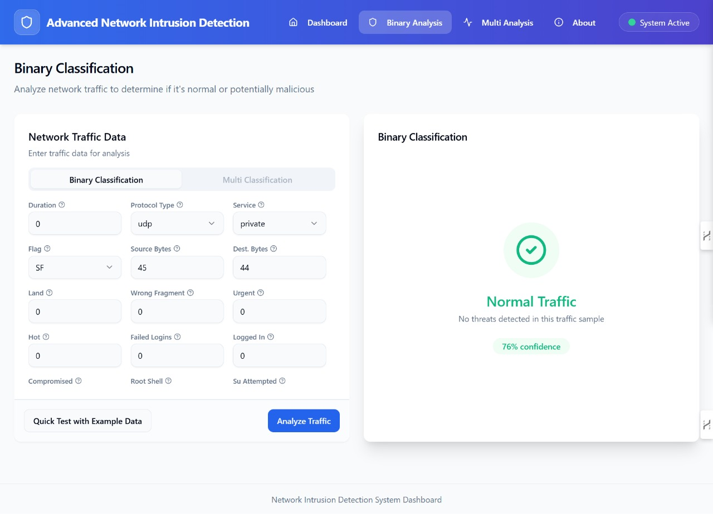
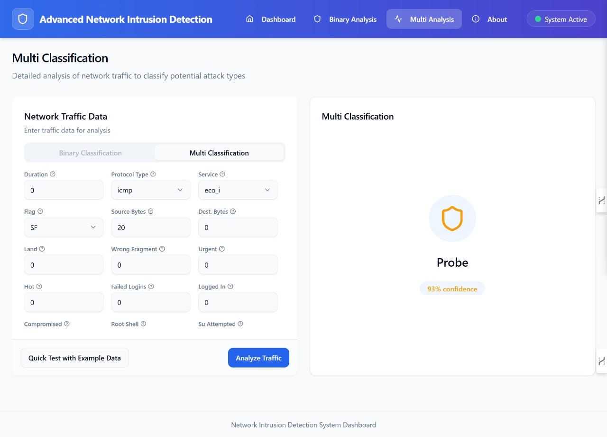
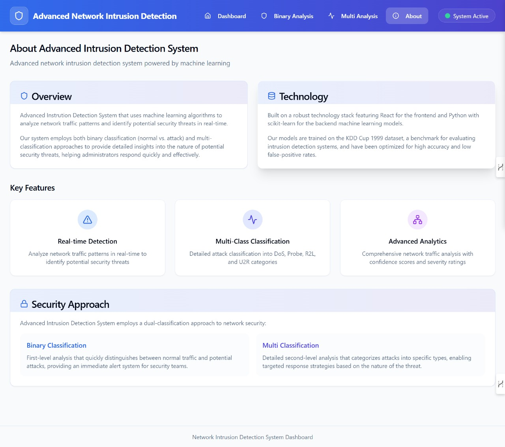

Frontend
```sh
npm i 

npm run dev
```

Backend (Python - 3.10.7)
```sh
cd backend

py -3.10 -m venv venv

venv/Scripts/activate

pip install -r requirements.txt

python app.py
```


## 💻 UI Screenshots

### Dashboard


### Binary


### multi


### about



## 🌐 Live Demo

Check out the live demo here: [🔗 Click to View Website](https://networkintrusiondetectionsystem.netlify.app/)
